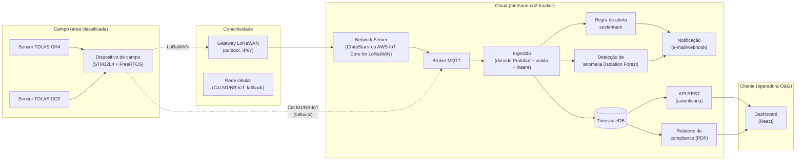
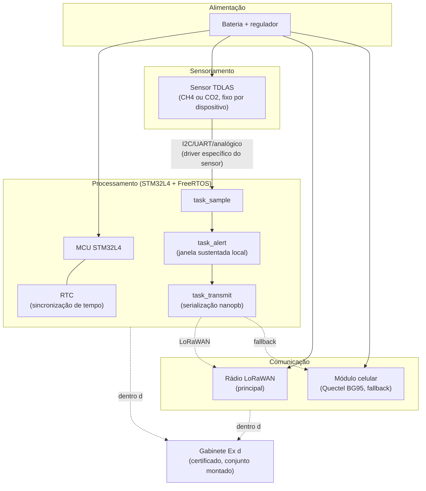

# Diagramas de blocos — Methane & CO2 Tracker

| Documento | Diagramas de blocos — sistema e dispositivo de campo |
|---|---|
| Projeto | Methane & CO2 Tracker |
| Revisão | 01 |
| Data | 2026-07-25 |
| Repositórios relacionados | `methane-co2-tracker` (software), `methane-co2-tracker-firmware` (firmware) |

## Nota sobre a norma aplicada

Não existe uma norma ABNT específica para diagrama de blocos de sistemas
eletrônicos embarcados equivalente à IEC 60617 (a NBR 5444, às vezes citada
nesse contexto, trata de símbolos para **instalações elétricas prediais** —
tomadas, interruptores, eletrodutos — não de blocos funcionais de um
sistema embarcado). Os diagramas abaixo seguem:

- **Convenções gerais de apresentação de desenho técnico** que de fato são
  normatizadas pela ABNT independente do assunto (NBR 10068 — folha de
  desenho; NBR 8402 — lettering), refletidas aqui no bloco de identificação
  no topo do documento e na legenda explícita de convenções de linha
  abaixo.
- **Símbolos IEC 60617** onde um símbolo elétrico pontual é usado (terra,
  bateria) — é a referência internacional que o Brasil também adota para
  esse tipo de símbolo.
- Não são esquemáticos elétricos em nível de componente (sem resistores,
  pinout de MCU) — isso exigiria dados de projeto eletrônico real (KiCad),
  que não existem ainda nesta fase do MVP.

## Legenda (convenções de linha usadas nos dois diagramas)

- Linha sólida `───` : conexão física/com fio, ou fluxo de dados sempre
  presente.
- Linha tracejada `┄┄` : enlace sem fio (rádio).
- Linha pontilhada `┈┈` : caminho de fallback, usado só quando o caminho
  principal falha.

## 1. Diagrama de blocos — sistema (campo → nuvem → cliente)

## 2. Diagrama de blocos — dispositivo de campo

## Como estes diagramas se relacionam com o código

- O diagrama 1 corresponde ao pipeline descrito em
  `docs/hardware-cloud-integration.md`.
- O diagrama 2 corresponde às tasks FreeRTOS do esqueleto de firmware em
  `methane-co2-tracker-firmware/src/` (`task_sample.c`, `task_alert.c`,
  `task_transmit.c`) e ao HAL de rádio (`radio_hal.c`).
- O bloco "Gabinete Ex d" no diagrama 2 corresponde ao item de
  certificação de conjunto em `docs/atex-certification-checklist.md`.
